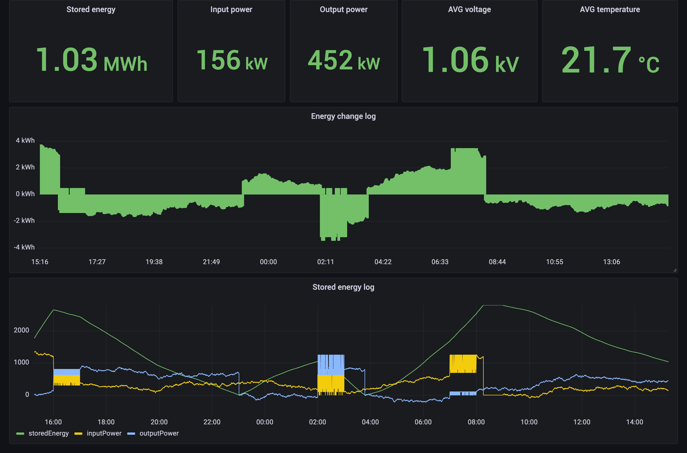

# mqtt-to-influxdb

Ingesting time series data into InfluxDB using MQTT and EMQX | MQTT InfluxDB Integration

## Introduction

This tutorial will show you how to use MQTT to ingest IoT data into InfluxDB. We will be using the [EMQX](https://www.emqx.io/) MQTT broker to publish and subscribe to messages. We will also be using the [InfluxDB](https://influxdata.com/) database to store the data.

EMQX and InfluxDB Complement Each Other in IoT Applications:

1. Real-time Data Processing: InfluxDB, combined with EMQX's Data Integration, enables real-time processing of MQTT IoT data with custom logic and transformations.

2. High-Performance Data Ingestion: EMQX efficiently transfers MQTT data to InfluxDB, ensuring reliable and high-speed data ingestion for IoT applications.

3. Scalable Data Storage and Analytics: InfluxDB provides scalable time-series data storage and advanced analytics, supporting the storage and analysis of growing volumes of IoT data.

4. End-to-End IoT Solution: The combination of InfluxDB, EMQX Data Integration offers a seamless end-to-end IoT solution, enabling real-time processing, scalable storage, and analytics for IoT applications.

By leveraging these capabilities, organizations can achieve real-time processing, efficient data ingestion, scalable storage, and comprehensive analytics for their IoT deployments.



This demo showcases an IoT energy storage solution that involves data collection, real-time processing, monitoring, and management of the energy storage system using EMQX and InfluxDB. The solution enables data collection from the energy storage unit and transfer to EMQX with MQTT, then utilizes data integration processing and store the data in InfluxDB.

It provides monitoring and analysis of energy input/output, current power, as well as battery status, performance, and health. Through alarm and event management, it detects and addresses anomalies in the energy storage system or batteries.

## Architecture

| Name      | Version | Description                                                                      |
| --------- | ------- | -------------------------------------------------------------------------------- |
| [EMQX Enterprise](https://www.emqx.com/en/products/emqx)      | 5.0.3+  | MQTT broker used for message exchange between MQTT clients and the ClickHouse. |
| [MQTTX CLI](https://mqttx.app/cli) | 1.9.3+  | Command-line tool used to generate simulated data for testing.        |
| [InfluxDB](https://influxdata.com/)     | 2.0.0+  | Charging station IoT data storage and management, as well as providing time aggregation and analysis capabilities for Grafana.      |
| [EMQX Exporter](https://github.com/emqx/emqx-exporter)      | 0.1 | Prometheus exporter for EMQX |
| [Prometheus](https://prometheus.io/)   | v2.44.0  | Open-source systems monitoring and alerting toolkit.       |
| [Grafana](https://grafana.com/)   | 9.5.1+  | Visualization platform utilized to display and analyze the collected data.       |


## How to use

<!-- 1. Init the submodule to get the EMQX Exporter  (Optional):

  ```bash
  git submodule init
  git submodule update
  ``` -->

1. Please make sure you have installed the [docker](https://www.docker.com/), and then running the following commands to start the demo:

  ```bash
  docker-compose up -d
  ```

  > You can quickly init submodule and start the demo by using the `make` command as well.

2. Running the following commands to see the message from MQTTX:

  ```bash
  docker logs -f mqttx
  ```

3. You can open <http://localhost:8086> in your browser, and login with `admin`, `EMQX_Demo_1234` to view the data in InfluxDB.

4. If you want to view the energy storage data and EMQX Metrics in Grafana dashboard, you can open <http://localhost:3000> in your browser, and login with `admin:public`.

## License

[Apache License 2.0](./LICENSE)
